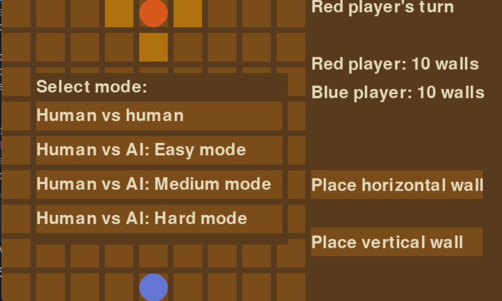
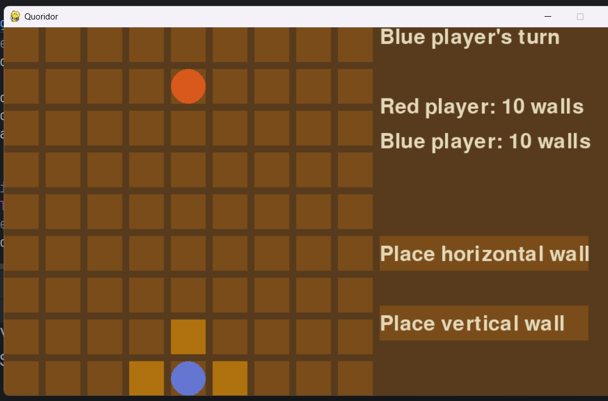
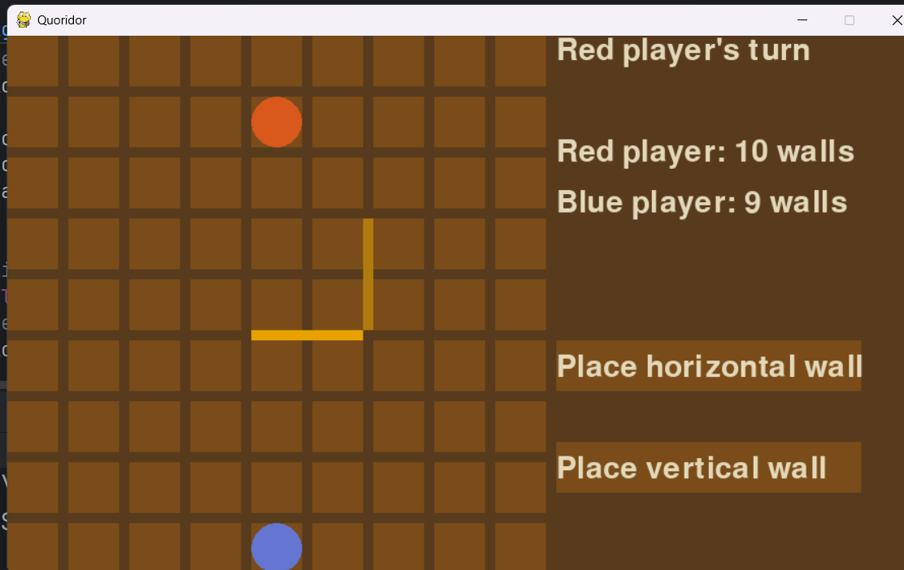

# Quoridor

I implemented 2-player Quoridor, here are the rules:\
Movement:

+ On each turn, a player must either move their pawn or place a wall
+ Pawns move one square orthogonally (not diagonally)
+ Players cannot move through walls or opponent pawns
+ If a player's pawn is adjacent to an opponent's pawn, the player can jump over
  the opponent's pawn (if there's no wall blocking)
+ If a jump is blocked by a wall, the player can move diagonally around the
  opponent's pawn if not blocked by a wall

Wall Placement:

+ Walls are two squares long and are placed on the edges between squares
+ Walls cannot overlap or cross other walls
+ Walls cannot be placed to completely block a player's path to the goal (there
  must always be a valid path to the goal for each player)
+ Once placed, walls cannot be moved

## Screenshots:

## How to install and run the Game

### Method 1: Pycharm:

1. Open the Project: Launch PyCharm, click Open, and select the folder containing this game's source files.
2. Install the Graphics Library (Pygame):

+ Go to the top menu and select File > Settings (on macOS: PyCharm > Preferences).
+ In the left sidebar, click on your project name, then click Python Interpreter.
+ Click the + (Add Package) icon.Type pygame into the search bar, select it from the list, and click Install
  Package.Once it says "Package 'pygame' installed successfully", close the settings window.

3. Run the Game: Open the main.py file from the left project sidebar, right-click anywhere inside the code area, and
   select Run 'main' (or click the green play button in the top right corner).

### Method 2: VS Code:

1. Open the Project: Launch VS Code, click File > Open Folder..., and choose the game folder.
2. Install the Python Extension: Click on the Extensions icon on the far left sidebar (the 4 squares icon), search for
   Python (by Microsoft), and click Install.
3. Install the Graphics Library (Pygame):

+ Open the main.py file.
+ If VS Code displays a pop-up in the bottom right corner warning that pygame is not installed, simply click the Install
  button on the pop-up. VS Code will handle the installation visually.

4. Run the Game: Click the white Play button located in the top-right corner of the window to launch the game.

## Controls explanation:
+ Mouse left click: Move pawn/ place wall.
+ Q: Restart the game.
+ U: Undo the last move
+ R: Redo the last move

## Demo video:
Link: https://drive.google.com/file/d/1xQm4kj-s3mfjYLugbuVeS9t_URvHmyTe/view?usp=sharing
